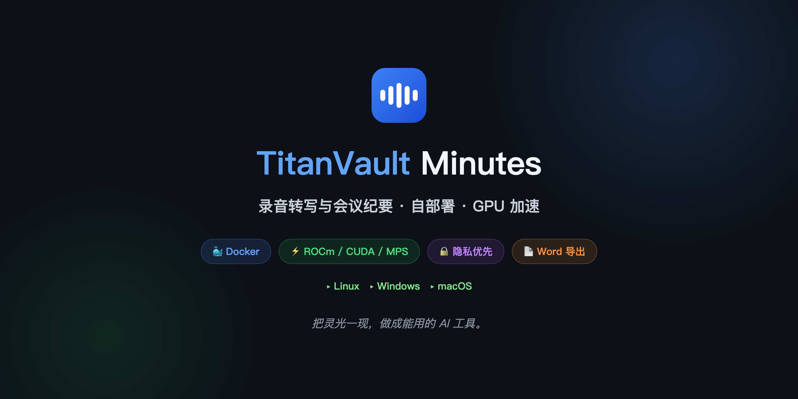

<div align="center">

# Aham Voice Web

**录音转写与会议纪要 · 自部署 Web 版 · GPU 加速 · 隐私优先**

[](LICENSE)
[](#)
[](#)
[](#)



[English](#english) · [中文](#中文)

</div>

---

<a id="中文"></a>

## 中文

> 基于 [aham-voice](https://github.com/li599198347-svg/aham-voice)（MIT，原项目已归档）改造。

### 为什么做

录音转写工具不少，但多是网页服务：音频要上传到别人的服务器，转写完只给一段没分说话人、没结构的纯文本。本地能离线跑的，又通常停在「出一段字」。

**Aham Voice Web** 把整条链路在你的服务器上接完整——转写、说话人分离、声学情绪全部本地离线 GPU 加速，只有纪要才交给你的大模型，音频和数据不离开你的机器。

### 与原版的区别

本项目 fork 自 [aham-voice](https://github.com/li599198347-svg/aham-voice)（macOS 桌面应用，MIT），核心转写/声纹/纪要/情绪管线原样保留，**重做了形态、平台、扩展性和工程结构**：

| 维度 | 原版 aham-voice | 本项目 aham-voice-web |
|---|---|---|
| 🖥️ **形态** | macOS 桌面 app（pywebview 打包 `.app`） | **Web 应用**，浏览器访问，手机/平板同 Wi-Fi 可用 |
| 💻 **平台 / GPU** | 仅 macOS · MPS | **Linux + Windows** · CUDA / **ROCm（AMD）** / CPU 三档；**Mac 原生 MPS** |
| 🤖 **大模型** | 硬编码 DeepSeek | **任意 OpenAI 兼容端点**（DeepSeek / 通义 / Kimi / Ollama / vLLM） |
| 🏷️ **热词** | 仅手工录入 / txt 导入 | + **LLM 智能发现**：转写后自动抽取候选词 → 批量审阅确认 |
| 📝 **纪要** | 模板 + 改写 | + **热词规范名注入**、**智能分块**、**时间戳跳转音频**、**docx 导出** |
| 🔐 **访问控制** | 多用户体系（users / sessions / teams / roles） | **单密码门**（删掉多用户死代码，局域网共享够用） |
| 📦 **部署** | 手动打包 `.app` | **`docker compose up -d`** 一键起，含模型自动下载 |
| 🧩 **代码结构** | 单文件 `main.py` 5000+ 行 | **拆成 13 个聚焦模块**（asr / hotwords / voiceprint / summary / emotion …） |
| 🧪 **测试** | 无 | **pytest + 74 单测**（config / security / 热词发现 / docx / 方言纠错等） |
| 🩺 **健壮性** | — | 中断任务自动恢复、ffmpeg 路径 fallback、错误信息脱敏 |

> Mac 用户可以用下方"Mac 原生部署"一键脚本（MPS GPU 加速），也可以用 Docker（仅 CPU）。

### 核心特性

| 特性 | 说明 |
|---|---|
| 🔒 **隐私优先** | 转写/说话人/情绪全部本地，音频不上传 |
| ⚡ **GPU 加速** | AMD ROCm / NVIDIA CUDA / CPU 三种模式，21 分钟录音 30 秒转完 |
| 🤖 **任意大模型** | 纪要走 OpenAI 兼容端点——DeepSeek / 通义 / Kimi / Ollama / vLLM 随便换 |
| 🏷️ **热词智能发现** | 转写后 LLM 自动抽取专业术语，批量审阅确认 |
| 📝 **结构化纪要** | 会议类型智能判断 + 智能分块 + 热词规范名注入，纪要专有名词写法统一 |
| 🌐 **方言口音纠错** | 贵州话/四川话等方言的近音错字，转写后 LLM 结合上下文纠正（实测纠错率约 80%） |
| 🔗 **时间戳跳转** | 纪要里的时间戳可点击，自动跳转音频对应位置播放 |
| 📄 **Word 导出** | 纪要支持 docx 导出（国内主流格式），Markdown/Word 自由切换 |
| 💬 **IM 集成** | API Token 供飞书/Hermes 等 agent 调用，发录音自动生成纪要发回 |
| 🗣️ **说话人分离** | CAM++ 声纹，逐句标注谁在说，声纹可管理 |
| 🎭 **双层情绪** | emotion2vec 声学层 + LLM 语义层对冲分析 |
| 🐳 **一键部署** | Docker 镜像，`docker compose up -d` 即用 |

### 快速开始

#### Mac 用户（原生 MPS 加速，一键脚本）

```bash
git clone https://github.com/kaka86mm/aham-voice-web.git
cd aham-voice-web
cp .env.example .env          # 填 LLM Key（纪要用）
./start-mac.sh                # 首次自动装依赖+下模型，约 5-10 分钟
```

脚本自动完成：检查环境 → 装 ffmpeg → 创建 venv → 装依赖 → 启动（MPS GPU 加速）。后续运行直接 `./start-mac.sh`。

浏览器打开 `http://localhost:8765`。

#### Linux / Windows（Docker）

```bash
git clone https://github.com/kaka86mm/aham-voice-web.git && cd aham-voice-web
cp .env.example .env          # 填密码 + LLM Key
docker compose up -d          # 首次自动下载 ~4GB 模型
```

浏览器打开 `http://<服务器IP>:8765`，手机/平板同 Wi-Fi 也能访问。

<details>
<summary><b>🖥️ GPU 加速</b></summary>

**NVIDIA CUDA**（Linux）：
```bash
# docker-compose.yml 改 image: aham-voice-web:gpu, dockerfile: Dockerfile.gpu
# 取消 deploy.resources 注释，.env 设 AHAMVOICE_ASR_DEVICE=cuda
```

**AMD ROCm**（gfx1151/Radeon 等）：
```bash
docker compose -f docker-compose.yml -f docker-compose.rocm.yml up -d
```

</details>

<details>
<summary><b>⚙️ 配置项（.env）</b></summary>

```bash
AHAMVOICE_ACCESS_PASSWORD=          # 空=裸奔；非空=启用单密码门
LLM_API_KEY=                         # OpenAI 兼容端点的 Key
LLM_API_BASE=https://api.deepseek.com
LLM_MODEL=deepseek-chat
AHAMVOICE_ASR_DEVICE=cpu             # cpu / cuda
```

</details>

<details>
<summary><b>🏗️ 架构</b></summary>

```
backend/app/
├── main.py            # FastAPI + 路由 + 静态托管
├── config.py          # 路径/env/LLM 配置
├── db.py              # SQLite + schema + 中断恢复
├── security.py        # 单密码门
├── asr.py             # FunASR 转写（枢纽）
├── hotwords.py        # 热词双轨系统
├── hotword_discover.py # 热词 LLM 智能发现
├── voiceprint.py      # 声纹多采样匹配
├── emotion.py         # emotion2vec + LLM 情绪
├── summary.py         # 纪要 map-reduce + 改写
└── deepseek.py        # LLM 传输层
```

</details>

<details>
<summary><b>🔧 本地开发</b></summary>

```bash
# 后端
python -m venv .venv && source .venv/bin/activate
pip install -r backend/requirements.txt
AHAMVOICE_HOME=/tmp/aham-dev python -m uvicorn backend.app.main:app --port 8765 --reload

# 前端（另一个终端）
cd frontend-src && npm install && npm run dev   # Vite 5174

# 测试
python -m pytest backend/tests/ -v
```

</details>

### 三平台分工

| 平台 | 方案 | GPU |
|---|---|---|
| **Mac** | 本项目一键脚本（`./start-mac.sh`）| MPS ✅ |
| **Linux** | 本项目 Docker | CUDA / ROCm / CPU |
| **Windows** | 本项目 Docker | CPU |

---

<a id="english"></a>

## English

> Forked from [aham-voice](https://github.com/li599198347-svg/aham-voice) (MIT, original archived).

### Why

Most transcription tools are cloud services: you upload audio to someone else's server, and get back unstructured plain text without speaker labels. Local tools usually stop at "here's some text."

**Aham Voice Web** completes the entire pipeline on your own server — transcription, speaker diarization, and acoustic emotion all run locally with GPU acceleration. Only the meeting summary goes to your LLM. Audio and data never leave your machine.

### What's different from the original

This project is forked from [aham-voice](https://github.com/li599198347-svg/aham-voice) (a macOS desktop app, MIT). The core transcription / voiceprint / summary / emotion pipeline is preserved as-is — **what we rebuilt is the form, platform, extensibility, and engineering structure**:

| Dimension | Original aham-voice | This project aham-voice-web |
|---|---|---|
| 🖥️ **Form** | macOS desktop app (pywebview, packaged `.app`) | **Web app** — browser access, phone/tablet on same Wi-Fi |
| 💻 **Platform / GPU** | macOS only · MPS | **Linux + Windows** · CUDA / **ROCm (AMD)** / CPU; **Mac native MPS** |
| 🤖 **LLM** | Hard-coded DeepSeek | **Any OpenAI-compatible endpoint** (DeepSeek / Qwen / Kimi / Ollama / vLLM) |
| 🏷️ **Hotwords** | Manual entry / txt import only | + **Smart LLM discovery**: auto-extract candidates post-transcription → batch review |
| 📝 **Summaries** | Template + revision | + **Glossary injection**, **smart chunking**, **timestamp seek to audio**, **docx export** |
| 🔐 **Access control** | Multi-user system (users / sessions / teams / roles) | **Single password gate** (removed multi-user dead code, enough for LAN sharing) |
| 📦 **Deployment** | Manual `.app` packaging | **`docker compose up -d`** one-command, with auto model download |
| 🧩 **Code structure** | Single `main.py` 5000+ lines | **Split into 13 focused modules** (asr / hotwords / voiceprint / summary / emotion …) |
| 🧪 **Tests** | None | **pytest + 74 unit tests** (config / security / hotword discovery / docx / dialect correction, etc.) |
| 🩺 **Robustness** | — | Interrupted-task auto-recovery, ffmpeg PATH fallback, sanitized error messages |

> Mac users can use the one-click native script below (MPS GPU acceleration), or Docker (CPU only).

### Key Features

| Feature | Description |
|---|---|
| 🔒 **Privacy-first** | Transcription/diarization/emotion all local — audio never uploaded |
| ⚡ **GPU accelerated** | AMD ROCm / NVIDIA CUDA / CPU — 21-min audio in 30 seconds |
| 🤖 **Any LLM** | Summaries via OpenAI-compatible endpoint — DeepSeek / Qwen / Kimi / Ollama / vLLM |
| 🏷️ **Smart hotword discovery** | LLM auto-extracts domain terms post-transcription, batch review |
| 📝 **Structured summaries** | Smart meeting-type detection + smart chunking + glossary injection for consistent terminology |
| 🌐 **Dialect correction** | LLM fixes tonal-dialect misrecognitions (Guizhou/Sichuan etc.) post-transcription (~80% correction rate) |
| 🔗 **Timestamp seek** | Click any timestamp in the summary to jump to that audio moment |
| 📄 **Word export** | Export summaries as .docx (de facto format in CN) or Markdown |
| 💬 **IM integration** | API Token for Feishu/Hermes agents — send audio, get summary back |
| 🗣️ **Speaker diarization** | CAM++ voiceprints, per-utterance speaker labels, manageable profiles |
| 🎭 **Dual-layer emotion** | emotion2vec acoustic + LLM semantic analysis |
| 🐳 **One-command deploy** | Docker image, `docker compose up -d` and you're running |

### Quick Start

#### Mac (native MPS acceleration, one-click)

```bash
git clone https://github.com/kaka86mm/aham-voice-web.git
cd aham-voice-web
cp .env.example .env          # Set LLM key (for summaries)
./start-mac.sh                # First run: auto-installs deps + models (~5-10 min)
```

The script auto-checks environment, installs ffmpeg, creates venv, installs deps, and launches with MPS GPU acceleration. Subsequent runs: just `./start-mac.sh`.

Open `http://localhost:8765`.

#### Linux / Windows (Docker)

```bash
git clone https://github.com/kaka86mm/aham-voice-web.git && cd aham-voice-web
cp .env.example .env          # Set password + LLM key
docker compose up -d          # Auto-downloads ~4GB models on first run
```

Open `http://<server-ip>:8765` in your browser. Phones/tablets on the same Wi-Fi can access it too.

<details>
<summary><b>🖥️ GPU Acceleration</b></summary>

**NVIDIA CUDA** (Linux):
```bash
# Edit docker-compose.yml: image: aham-voice-web:gpu, dockerfile: Dockerfile.gpu
# Uncomment deploy.resources, set AHAMVOICE_ASR_DEVICE=cuda in .env
```

**AMD ROCm** (gfx1151/Radeon etc.):
```bash
docker compose -f docker-compose.yml -f docker-compose.rocm.yml up -d
```

</details>

<details>
<summary><b>⚙️ Configuration (.env)</b></summary>

```bash
AHAMVOICE_ACCESS_PASSWORD=          # Empty=no gate; set to enable password
LLM_API_KEY=                         # Your OpenAI-compatible API key
LLM_API_BASE=https://api.deepseek.com
LLM_MODEL=deepseek-chat
AHAMVOICE_ASR_DEVICE=cpu             # cpu / cuda
```

</details>

### License

[MIT](LICENSE) — forked from [aham-voice](https://github.com/li599198347-svg/aham-voice) (MIT)

---

<div align="center">

**把灵光一现，做成能用的 AI 工具。**

*Turn sparks of insight into AI tools that actually work.*

</div>
